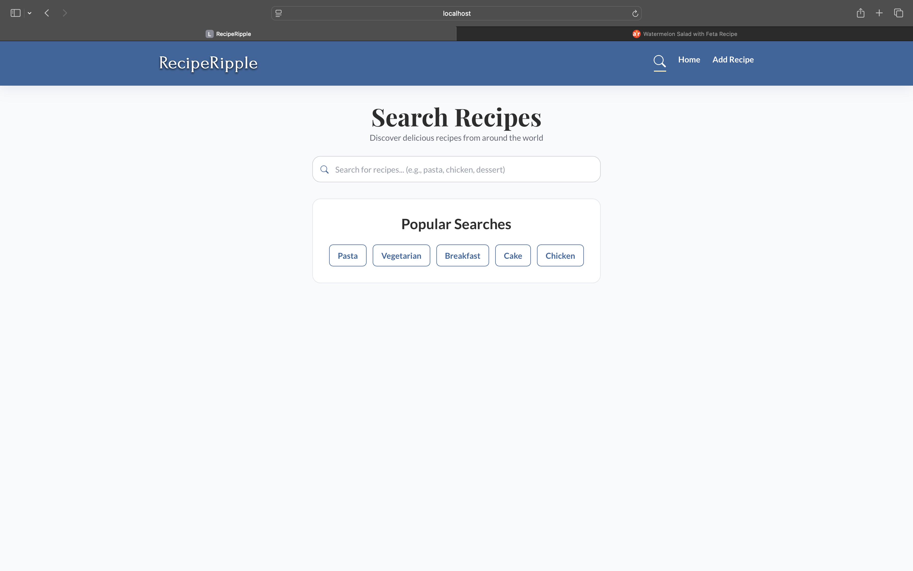
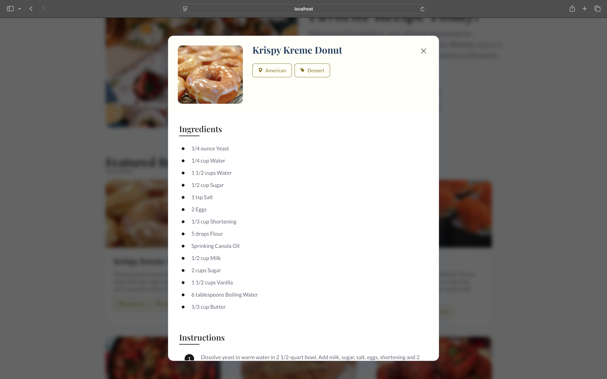
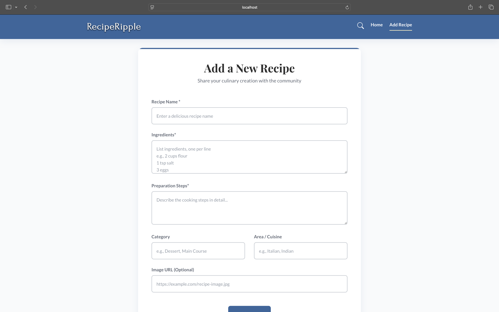
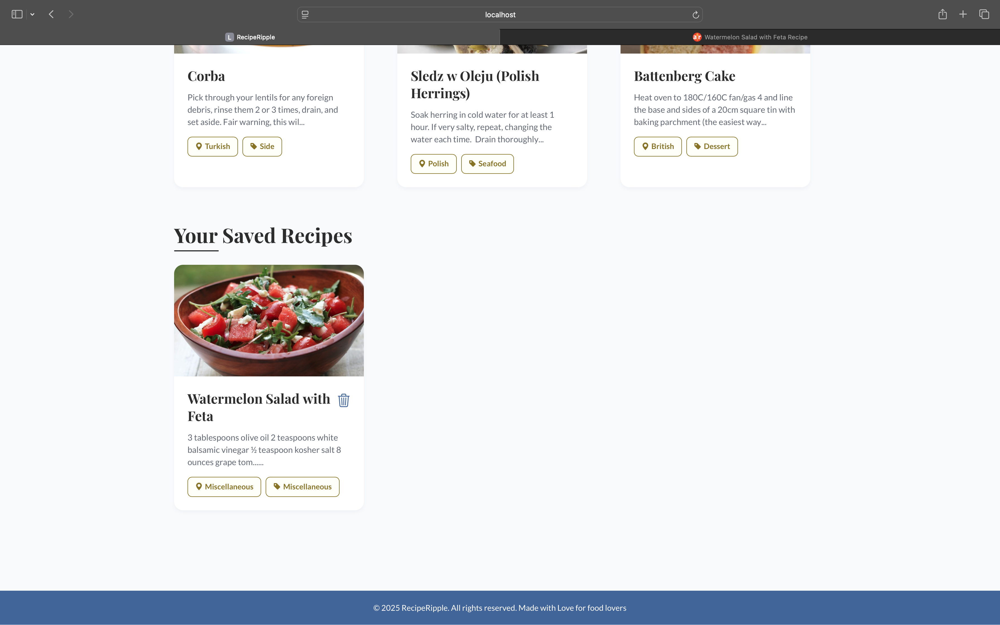

# Recipe Ripple Web Application

## 🌐 Overview

**Recipe Ripple** is a React-based web application that allows users to search for and manage recipes in a simple, interactive interface. It uses **TheMealDB API** to fetch a wide variety of recipes and also lets users add their own, which are stored locally in the browser.

---

## 🚀 Features

- 🔍 **Search Recipes**: Find meals by keyword using **TheMealDB API**.
- 📄 **Recipe Details**: View ingredients, instructions, and images in a modal.
- ➕ **Add Custom Recipes**: Manually add your own recipes with title, ingredients, and instructions.
- 🗑️ **Delete Recipes**: Remove personal recipes from your local collection.
- 💾 **LocalStorage Support**: All custom recipes are saved to the browser’s local storage for persistence.
- ❌ **Error Handling**: Graceful fallbacks for empty searches or API issues.

---

## 🛠 Technologies Used

| Category     | Tech Stack                                 |
| ------------ | ------------------------------------------ |
| Frontend     | HTML, CSS, JavaScript, React               |
| Styling      | CSS Modules, Bootstrap                     |
| API          | [TheMealDB API](https://www.themealdb.com) |
| State Mgmt   | React hooks (`useState`, `useEffect`)      |
| Storage      | `localStorage`                             |
| Package Mgmt | npm                                        |

---

## 📦 Installation Instructions

1. **Clone the repository**

   ```bash
   git clone https://github.com/dhokabhoomi/RecipeRipple.git
   ```

2. **Navigate into the project directory**

   ```bash
   cd recipe-book
   ```

3. **Install dependencies**

   ```bash
   npm install
   ```

4. **Start the development server**
   ```bash
   npm run start
   ```

> ✅ No API key required — TheMealDB offers open access to most endpoints.

---

## 🧑‍🍳 How to Use

- Enter a keyword in the search bar to find recipes.
- Click on a recipe card to view full details in a modal.
- Use the "Add Recipe" form to create your own recipe entries.
- Delete unwanted recipes from your custom list.

---

## 🖼️ Screenshots

| Home Page                           |
| ----------------------------------- |
|  |

| Search Recipes                           | Recipe Details                               |
| ---------------------------------------- | -------------------------------------------- |
|  |  |

| Add Custom Recipe                        | Your Saved Recipes                         |
| ---------------------------------------- | ------------------------------------------ |
|  |  |

---

## 🤝 Contributing

We welcome contributions! To contribute:

1. Fork the repository
2. Create a new branch
   ```bash
   git checkout -b feature/YourFeature
   ```
3. Make your changes and commit
   ```bash
   git commit -m "Add your feature"
   ```
4. Push your branch
   ```bash
   git push origin feature/YourFeature
   ```
5. Open a Pull Request

---

## 📬 Contact

Open an issue or reach out on GitHub for feedback, bugs, or suggestions.

---

## 🙏 Acknowledgments

- Thanks to [TheMealDB](https://www.themealdb.com) for their free recipe API.
- Built with love for food, learning, and development.
